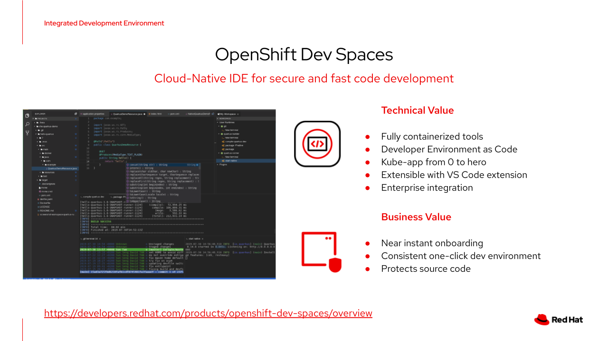
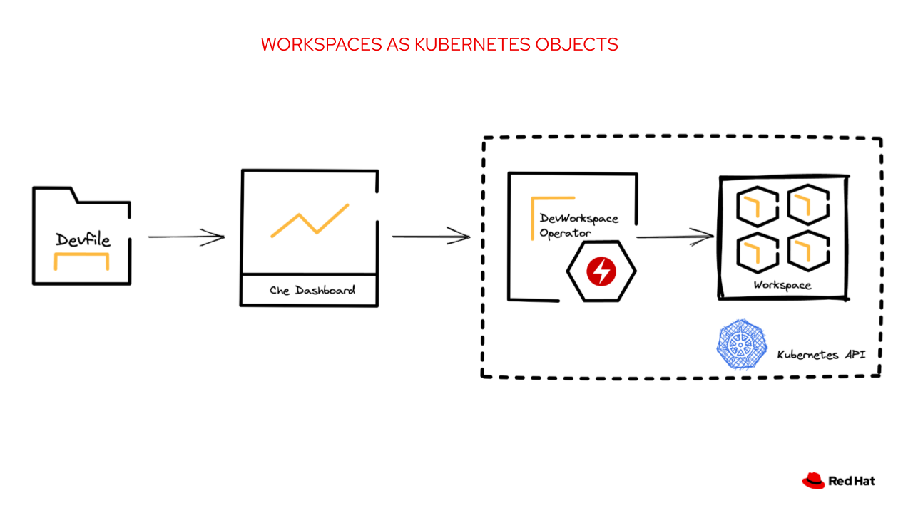
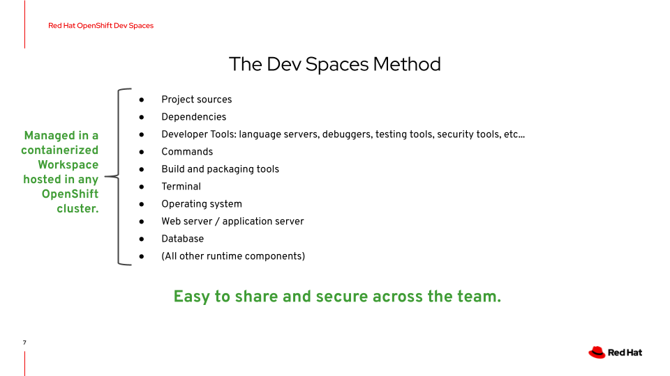

# 5-minute demo: OpenShift Dev Spaces
For more information, please see the [official product pages](https://access.redhat.com/products/red-hat-openshift-dev-spaces).

## Table of Contents
- **[Introduction to Dev Spaces](#introduction-to-dev-spaces)**<br>
- **[Install Dev Spaces using Operators](#lets-get-started)**<br>
- **[Create HelloWorld app in yur workspace](#lets-test-our-workspace)**<br>
- **[Set up a dev environment on OpenShift](#lets-set-up-our-dev-namespace)**<br>
- **[Code Build Deploy with OpenShift Dev Spaces](#lets-code-innerloop)**<br>
- **[Next Steps](#next-steps)**<br>

---
## Introduction to Dev Spaces
A collaborative Kubernetes-native solution for rapid application development that delivers consistent developer environments on Red Hat OpenShift to allow anyone with a browser to contribute code in under two minutes.



---
Red Hat OpenShift Dev Spaces provides developer workspaces with everything you need to code, build, test, run, and debug applications:

- Project source code
- Web-based integrated development environment (IDE)
- Tool dependencies needed by developers to work on a project
- Application runtime: a replica of the environment where the application runs in production

Pods manage each component of a OpenShift Dev Spaces workspace. Therefore, everything running in a OpenShift Dev Spaces workspace is running inside containers. This makes a OpenShift Dev Spaces workspace highly portable.

The embedded browser-based IDE is the point of access for everything running in a OpenShift Dev Spaces workspace. This makes a OpenShift Dev Spaces workspace easy to share.

---

## Let's get started!
NOTE: All steps performed as part of this demo can be executed from your local IDE or from OpenShift DevSpaces.

If you plan to use DevSpaces, please ensure that the OpenShift DevSpaces Operator is installed on your cluster.
The DevSpaces Operator can be installed through OpenShift Console or fully automated using [Red Hat COP GitOps Catalog](https://github.com/redhat-cop/gitops-catalog/tree/main/openshift-gitops-operator)
We can also run the env setup script in ./devspaces-setup folder

```shell
./00-ocp-devspaces/devspaces-setup/devspaces.sh
```

After successful installation, we can access our DevSpaces using the devspaces route

```
oc get route devspaces -o template --template='{{.spec.host}}' -n openshift-devspaces
```
Now we'll log in to our Dev Spaces using OpenShift credentials and create a new workspace from our Git repo.

---

Our Git repo contains a devfile. Devfiles are yaml text files used for development environment customization. We'll use them to configure our projects' specific needs and share the customized devfile across the team to ensure identical user experience and build, run, and deploy behaviours.

```yaml
schemaVersion: 2.1.0
metadata:
  name: ocp-devex-demos
attributes:
  controller.devfile.io/storage-type: common
projects:
  - git:
      remotes:
        origin: 'https://github.com/adnan-drina/ocp-devex-demos.git'
    name: ocp-devex-demos
components:
  - name: dev-tools
    container:
      image: 'registry.redhat.io/devspaces/udi-rhel8@sha256:df1961e226def97a83d403e46f7ddce9f0cdc6a97d7b894b33da718e34c5fcb3'
      memoryLimit: 2Gi
      mountSources: true
      sourceMapping: /projects
```
You do not need a devfile to start a workspace. If you do not include a devfile in your project repository, Red Hat OpenShift Dev Spaces automatically loads a default devfile with a Universal Developer Image (UDI).

[OpenShift Dev Spaces devfile registry](https://github.com/eclipse-che/che-devfile-registry) contains ready-to-use devfiles for different languages and technologies.

So, after providing your Git repo with or without a devfile to Che via API or Dashboard, the DevWorkspace Operator will provision your Workspace as a set of containers running on OpenShift, and we'll access and execute commands in our Workspace using our favourite web browser.



---

## Let's test our Workspace

To test our workspace, we'll create a simple dotnet Hello World application and run ```dotnet publish``` command to prepare our application for deployment.

```shell
dotnet new web -o webapp
cd webapp
dotnet publish -c Release
```
A new folder should appear in our application directory /bin/Release/net6.0/publish.
With this, our dotnet Hello World is ready for deployment to OpenShift.

---

## Let's set up our dev namespace

The first thing we'll do is connect to OpenShift API from our Workspace Terminal. We'll use our OpenShift credentials.

```shell
oc login -u myuser -p mypassword
```
Now we'll create a new OpenShift project (kubernetes namespace) to host our development inner loop activities.

```shell
oc new-project my-dev-sandbox
```

With the dev project created, we can start preparing our application build resources.
- We'll first create a new binary build object for our dotnet 6 application.
- Once defined, we can trigger our build by providing our application build artefacts.

```shell
oc new-build dotnet:6.0 --binary --name=mywebapp -l app=mywebapp
oc start-build mywebapp --from-dir=./bin/Release/net6.0/publish --follow
```

After build completion, a newly created container image will be available for deployment. We can check our container images by describing image stream objects on OpenShift.

```shell
oc describe is mywebapp
```

With new container images in place, we can trigger the deployment of our application.
```shell
oc new-app mywebapp
```

We'll also run following commands to expose our service to the world and add a health check:
```shell
oc expose service/mywebapp \
&& oc set probe deployment/mywebapp  --readiness --get-url=http://:8080 --initial-delay-seconds=5 --period-seconds=5 --failure-threshold=15
```

Now everyone can access our app from the web using a route
```shell
oc get route mywebapp
```

---

## Let's code (innerloop)
With our Workspace and Dev project in place, we can now start our inner loop development process and rapidly code, build and deploy applications on OpenShift.

### CODE:
Let's make a change in our app Program.cs

### BUILD:
Build our app locally
```shell
dotnet publish -c Release
```

### DEPLOY:
By starting a new build, we instruct OpenShift to build a new container image, publish that image in the OpenShift image registry and trigger a new deployment in our dev namespace.
```shell
oc start-build mywebapp --from-dir=./bin/Release/net6.0/publish
```

After build completion, we should see our changes in the web browser.

---

## What Next?

Try it out for free [Start developing directly on OpenShift with Red Hat OpenShift Dev Spaces](https://developers.redhat.com/developer-sandbox/ide).
You can quickly spin up a development environment with everything you need, all hosted on OpenShift.

---

## Key takeaways

Dev Spaces
- Accelerate onboarding of projects and developers.
- Removes inconsistencies and “it works on my machine...” delays.
- Protects source code by removing it from hard-to-secure laptops.

And the method used to enable this is pictured below.



- **Code:** Simplify on-boarding and coding with always-available, infinitely scalable developer workspaces.
- **Collaborate more efficiently:** Cut configuration time and share workspaces easily. Integrate with the tools you already use.
- **Secure:** Centrally host source code to improve security without sacrificing speed.


---

## Let's clean it up.

We can delete all application artefacts by applying the label ``-l app=mywebapp`` and finally delete our project (kubernetes namespace).

```shell
oc delete all -l app=mywebapp
oc delete project my-dev-sandbox
```
---

links:
https://access.redhat.com/documentation/en-us/red_hat_enterprise_linux/8/html/developing_.net_applications_in_rhel_8/using-net-core-on-ocp_gsg
