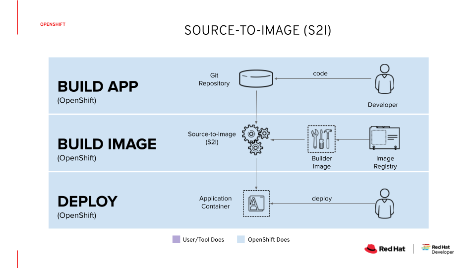

# 5-minute demo: OpenShift Builds
For more information, please see the [official product documentation](https://docs.openshift.com/container-platform/4.11/cicd/builds/understanding-image-builds.html).

## Table of Contents
- **[Introduction to OpenShift Builds](#introduction-to-openshift-builds)**<br>
- **[Set up a dev environment on OpenShift](#lets-set-things-up)**<br>
- **[Deploy a Hello World application from GitHub](#deploy-a-net-core-application-from-github)**<br>
- **[](#p)**<br>
- **[](#)**<br>

---

## Introduction to OpenShift Builds
A build in OpenShift Container Platform is the process of transforming input parameters into a resulting object. Most often, builds are used to transform source code into a runnable container image.

### Source-to-image (S2I) build
The source-to-image strategy creates a new container image based on application source code or application binaries. Red Hat OpenShift clones the application source code, or copies the application binaries into a compatible builder image, and assembles a new container image that is ready for deployment on the platform.



---

## Let's set things up
OpenShift Builds are integrated part of the OpenShift Container Platform, and dont require any installation or configuration.
We only need to ensure that we have a connection to our OpenShift cluster and enough privileges to create a project (kubernetes namespace).

- Login to OpenShift cluster
```shell
oc login -u myuser -p mypassword
```
- Create a new OpenShift project
```shell
oc new-project s2i-demo
```
- Verify that the project is empty
```shell
oc get all
```

## Deploy a .NET Core application from GitHub

```shell
oc new-app --name=dotnet-demo 'dotnet:6.0-ubi8~https://github.com/redhat-developer/s2i-dotnetcore-ex#dotnet-6.0' \
--build-env DOTNET_STARTUP_PROJECT=app
```

View the status of your app
```shell
oc status
```

Make the .NET Core application accessible externally
```shell
oc expose service s2i-dotnetcore-ex
```

Access the service using the Route URL
```shell
ROUTE="http://$(oc get route s2i-dotnetcore-ex -o jsonpath="{.spec.host}")"
curl -s $ROUTE | grep Welcome
```

# Clean it up
```shell
oc delete all -l app=s2i-dotnetcore-ex
oc delete project s2i-demo
```

# Resources Created by the oc new-app Command
The oc new-app command adds the following resources to the current project to support building and deploying an application:
   - A build configuration to build the application container image from either source code or a Dockerfile.
   - An image stream pointing to either the generated image in the internal registry or to an existing image in an external registry.
   - A deployment resource using the image stream as input to create application pods.
   - A service for all ports that the application container image exposes.


# Check all available image streams
```shell
oc get is dotnet -n openshift -o name
```
# View existing image tags for dotnet
```shell
oc get istag -n openshift | grep dotnet
```
# Show additional information on image and image tag
```shell
oc describe is dotnet -n openshift
```