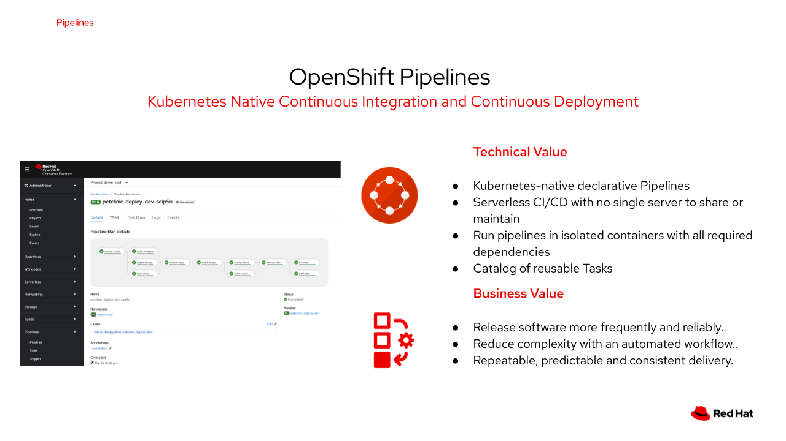
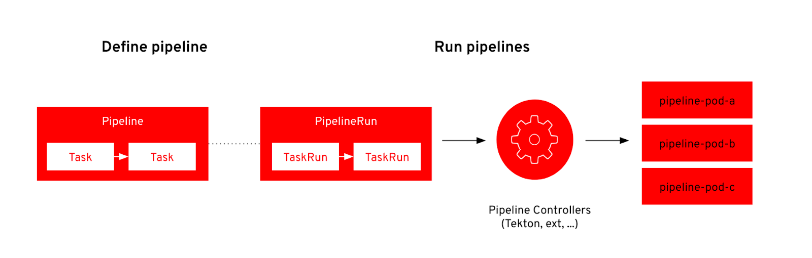
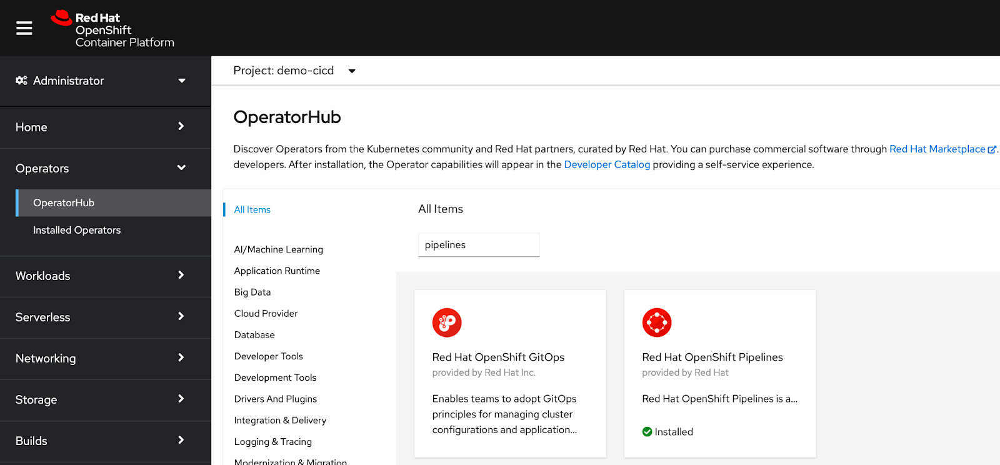

# 5-minute demo: OpenShift Pipelines
For more information, please see the [official product documentation](https://docs.openshift.com/container-platform/4.11/cicd/pipelines/understanding-openshift-pipelines.html).

## Table of Contents
- **[Introduction to OpenShift Pipelines](#introduction-to-openshift-pipelines)**<br>
- **[OpenShift Pipeline Concepts](#openshift-pipeline-concepts)**<br>
- **[Install OpenShift Pipelines operator](#install-openshift-pipelines-operator)**<br>
- **[Set up a dev environment on OpenShift](#set-up-a-dev-environment)**<br>
- **[Let's build a pipeline](#lets-build-a-pipeline)**<br>
- **[Key takeaways](#key-takeaways)**<br>

---

## Introduction to OpenShift Pipelines
Red Hat OpenShift Pipelines is a cloud-native, continuous integration and continuous delivery (CI/CD) solution based on Kubernetes resources. It uses Tekton building blocks to automate deployments across multiple platforms by abstracting away the underlying implementation details. Tekton introduces a number of standard custom resource definitions (CRDs) for defining CI/CD pipelines that are portable across Kubernetes distributions.



**Key features:**
- Red Hat OpenShift Pipelines is a serverless CI/CD system that runs pipelines with all the required dependencies in isolated containers.
- Red Hat OpenShift Pipelines are designed for decentralized teams that work on microservice-based architecture.
- Red Hat OpenShift Pipelines use standard CI/CD pipeline definitions that are easy to extend and integrate with the existing Kubernetes tools, enabling you to scale on-demand.
- You can use Red Hat OpenShift Pipelines to build images with Kubernetes tools such as Source-to-Image (S2I), Buildah, Buildpacks, and Kaniko that are portable across any Kubernetes platform.
- You can use the OpenShift Container Platform Developer console to create Tekton resources, view logs of pipeline runs, and manage pipelines in your OpenShift Container Platform namespaces.

---

## OpenShift Pipeline Concepts
Let's take a detailed view of the various pipeline concepts.



#### Concepts that define the pipeline

- Pipeline: the definition of the pipeline and the Tasks that it should perform
- Task: a reusable, loosely coupled number of steps that perform a specific task (e.g. building a container image)

#### Concepts that run the pipeline
- PipelineRun: the execution and result of running an instance of a pipeline, which includes a number of TaskRuns

---

## Install OpenShift Pipelines operator
Since it’s supported by an Operator, OpenShift Pipelines is very easy to install and upgrade.

- Log into your OpenShift cluster as an administrator and install OpenShift Pipelines.
  
  **Note:** If you dont have an OpenShift cluster available, you can use [OpenShift Developer Sandbox](https://developers.redhat.com/developer-sandbox).
  The sandbox is perfect for immediate access into OpenShift. With the sandbox, you'll get free access to a shared OpenShift and Kubernetes cluster.



  **Note:** If you dont want to use OpenShift Console GUI for installing Pipelines Operator, you can use [github.com/redhat-cop/gitops-catalog](https://github.com/redhat-cop/gitops-catalog).
```shell
oc apply -k https://github.com/redhat-cop/gitops-catalog/openshift-pipelines-operator/overlays/latest
```

---

## Set up a dev environment

- Let's create a new OpenShift project (Kubernetes namespace)
```shell
oc new-project dotnet-pipeline-app
```

Now that we have our development project we can 

- deploy a demo application
```shell
oc new-app --name=dotnet-demo 'dotnet:6.0-ubi8~https://github.com/redhat-developer/s2i-dotnetcore-ex#dotnet-6.0' \
--build-env DOTNET_STARTUP_PROJECT=app
```

---

## Let's build a pipeline
We'll create a simple two steps pipeline for building and deploying .Net applications.

### Define and a task
Tasks are the building blocks of a pipeline and consists of sequentially executed steps. 
It is essentially a function of inputs and outputs.
Tasks are reusable and can be used in multiple Pipelines.

As input, our example task takes source code from git and executes a dotnet publish command.
Once our application's compiled, the task will use a dotnet base image from the Red Hat catalogue and package our app as a container image.

We'll use this container image in the next task to trigger a new application deployment.

```yaml
apiVersion: tekton.dev/v1beta1
kind: Task
metadata:
  name: simple-publish
spec:
  resources:
    inputs:
      - name: source
        type: git
  steps:
    - name: simple-dotnet-publish
      image: registry.access.redhat.com/ubi8/dotnet-31 # .NET Core SDK
      securityContext:
        runAsUser: 0  # UBI 8 images generally run as non-root
      script: |
          #!/usr/bin/bash
          dotnet --info
          cd source
          dotnet publish -c Release -r linux-x64 --self-contained false "app/app.csproj"
```

### Define the pipeline
A Pipeline is a collection of Task resources arranged in a specific order of execution. They are executed to construct complex workflows that automate the build, deployment and delivery of applications. You can define a CI/CD workflow for your application using pipelines containing one or more tasks.

For example, we'll use a pipeline with two tasks executed in sequence, one after another.
- Our first task is called **s2i-build-source**, and this task will build our source code from git and, as a result, produce a container image.
- The next task is called **deployment**, and this tack will start a new application deployment based on the previously created container image.

```yaml
apiVersion: tekton.dev/v1beta1
kind: Pipeline
metadata:
  name: s2i-dotnet-pipeline
spec:
  resources:
    - name: source-repository
      type: git
    - name: image
      type: image
  tasks:
    - name: s2i-build-source
      taskRef:
        name: s2i-dotnet-3-pr
        kind: ClusterTask
      params:
        - name: TLSVERIFY
          value: "false"
      resources:
        inputs:
          - name: source
            resource: source-repository
        outputs:
          - name: image
            resource: image
    - name: deployment
      taskRef:
        name: update-deployment
        kind: Task
      runAfter:
        - s2i-build-source
      params:
        - name: deployment
          value: dotnet-demo
        - name: IMAGE
          value: image-registry.openshift-image-registry.svc:5000/dotnet-pipeline-app/app:latest
```

### Define a PipelineResource
We are almost ready to run our pipeline, we only need to provide it with some input, and for this, we'll use a PipelineResource definition.

As we run a simple pipeline, the only input we'll provide is the GitHub URL containing our application source code.

- As a set of parameters, we provide our git revision and URL.
```yaml
apiVersion: tekton.dev/v1alpha1
kind: PipelineResource
metadata:
  name: simple-dotnet-project-source
spec:
  type: git
  params:
    - name: revision
      value: dotnetcore-3.1-openshift-manual-pipeline
    - name: url
      value: https://github.com/adnan-drina/s2i-dotnetcore-ex
```

---

### Run the pipeline
The first thing we need to do to run our pipeline is to create previously defined artefacts.

- Let's create all needed artefacts by executing the following command.
```shell
oc apply -f ./02-ocp-pipelines/demo-pipeline.yaml
```
As a result, this command will create defined Tasks, Pipeline and PipelineResources.

We need one more thing and that's the PipelineRun resource.
A PipelineRun binds a pipeline and a set of parameter values specific to a scenario to run the CI/CD workflow.

- In our example we'll bind our simple-dotnet-pipeline Pipeline with simple-dotnet-project-source PipelineResources

```yaml
apiVersion: tekton.dev/v1beta1
kind: PipelineRun
metadata:
  generateName: run-simple-dotnet-pipeline-
spec:
  pipelineRef:
    name: simple-dotnet-pipeline
  resources:
    - name: source-repository
      resourceRef:
        name: simple-dotnet-project-source
```
As some of our tasks require additional privileges to build application source code, we'll grant those by creating a pipeline service account.

- Allow our pipeline to run privileged containers
```shell
oc create serviceaccount pipeline
oc adm policy add-scc-to-user privileged -z pipeline
oc adm policy add-role-to-user edit -z pipeline
```

- Run the pipeline
```shell
oc create -f ./02-ocp-pipelines/demo-pipeline-run.yaml
```

---

## Key takeaways
OpenShift Pipelines builds upon the Tekton project to enable teams to build Kubernetes-style delivery pipelines that they can fully control and own the complete lifecycle of their applications without having to rely on central teams to maintain and management a CI server, plugins, and its configurations.

- **Kubernetes style pipelines:** Create pipelines using standard Kubernetes CRDs that are portable across Kubernetes distributions.
- **Runs serverless:** Create and run pipelines, period. No CI/CD server to manage and maintain.
- **Deploy to multiple platforms:** Your pipelines run on Kubernetes, but you can deploy to many Kubernetes, VMs and serverless platforms from the pipeline.
- **Build images with Kubernetes tools:** You can use the build tool of your choice for building images. Source-to-Image (S2I), Buildah and Dockerfiles, Jib, Kaniko and more.
- **Developer tools:** Command-line tool to interact with the pipelines in addition to integrations with OpenShift developer console and IDE plugins.

---

### Let's clean things up
```shell
oc delete all -l app=dotnet-demo
oc delete project dotnet-pipeline-app
```